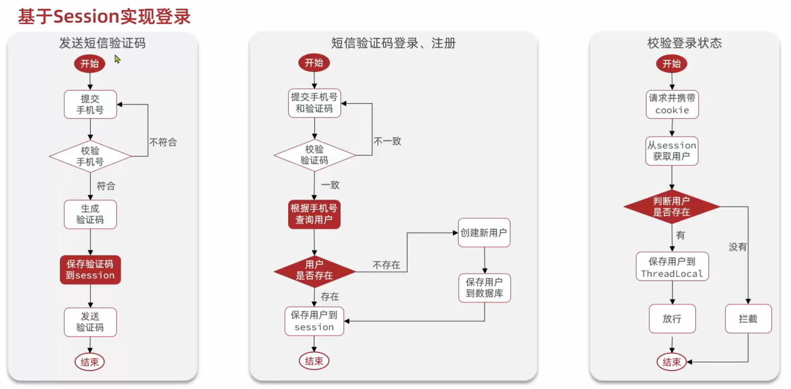
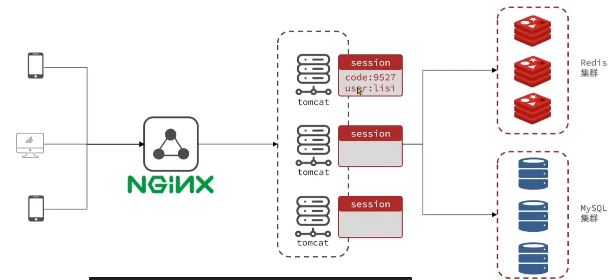
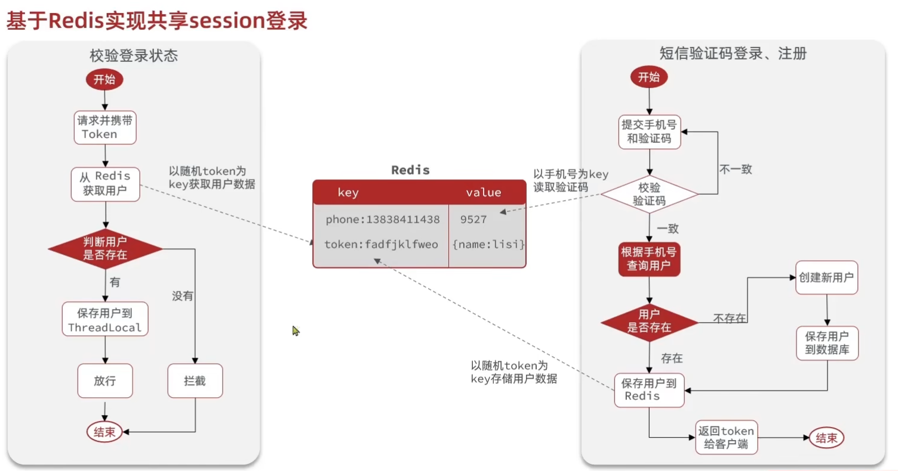

# 使用 Redis 对项目进行优化

## 1. 短信登录

### 1.1. 基础功能实现

### 1.2. session 共享问题

* 多台 session 不共享 session 存储空间
* 替代方案应满足
  * 数据共享
  * 内存存储（session 基于内存，读取频率高，性能要求高）
  * key，value 结构

### 1.3. 基于 Redis 实现 session 共享

* 验证码使用 string 保存
  * key：手机号
  * value：验证码
* 用户信息对象使用 hash 保存
  * key：随机 token
  * value：用户信息

